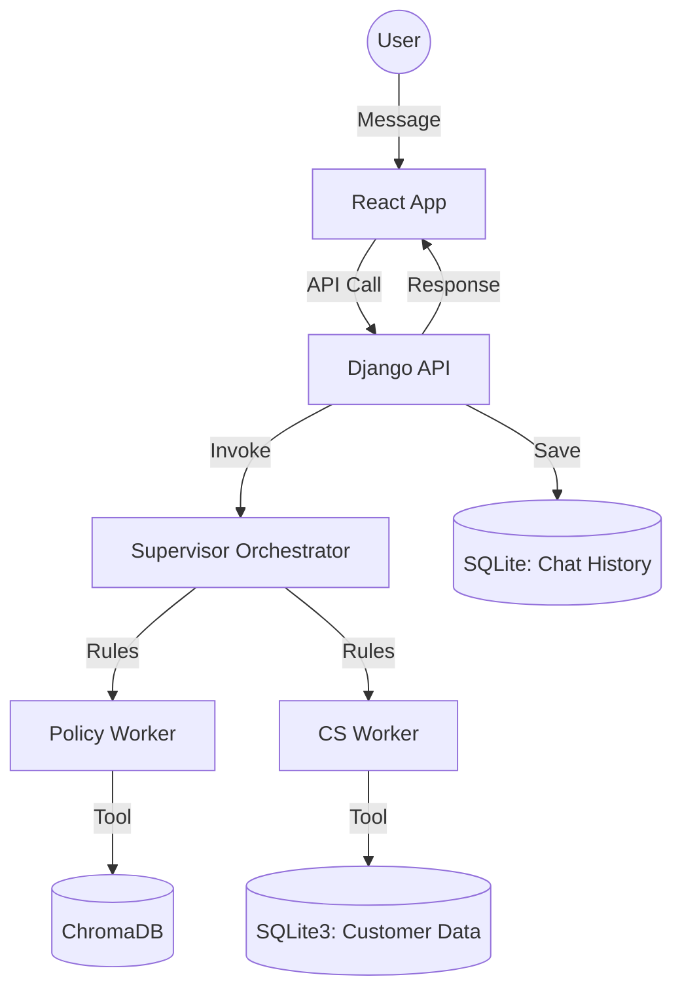

# TCS Support Orchestration System

This project implements a full-stack automated customer support orchestration system using **LangGraph**, **Django**, and **React**. It leverages a multi-agent "Orchestration-Worker" model to handle support tickets by combining bank policy document retrieval with live customer transaction history.

## 🏗️ Architecture

The system consists of a modular backend and a modern frontend, optimized for performance and reliability.

### 1. The Orchestrator (Backend)
- **Framework**: Django REST Framework + LangGraph.
- **Supervisor**: A rule-based orchestrator that ensures support tickets are validated against **Bank Policy** before analyzing **Customer Information**.
- **Specialized Workers**:
    - **Policy Expert**: RAG-based search through `Customer-Service-Policy.pdf` using ChromaDB.
    - **CS Representative**: SQL-based analysis of customer profile and ticket history.
- **Persistence**: Django models (`Conversation`, `Message`) store every interaction, accessible via the Django Admin panel.
- **Optimization**: Aggressive token management (truncation + iteration limits) for GPT-2 compatibility and path-aware initialization for Docker compliance.

### 2. The Interface (Frontend)
- **Framework**: React + Vite + Tailwind CSS.
- **Features**: Real-time chat interface, session persistence, and responsive design.

### 3. Data Flow


---

## 🚀 Getting Started

### Docker Setup (Recommended)
1. **Clone and Run**:
   ```bash
   git clone https://github.com/s29zafar/TCS_test.git
   cd TCS_test
   docker-compose up --build
   ```
   - **Frontend**: [http://localhost:5173](http://localhost:5173)
   - **Backend API**: [http://localhost:8000/api/](http://localhost:8000/api/)
   - **Admin Panel**: [http://localhost:8000/admin/](http://localhost:8000/admin/)

### Local Development
1. **Setup Virtual Environment**:
   ```bash
   source /Users/saimzafar2002-apple.com/venvs/python_3_12/bin/activate
   pip install -r requirements.txt
   ```
2. **Run Migrations**:
   ```bash
   python manage.py makemigrations chatbot
   python manage.py migrate
   ```
3. **Start Server**:
   ```bash
   python manage.py runserver
   ```

---

## 🧪 Testing & Verification
The system includes advanced unit tests covering API endpoints, model persistence, and supervisor routing.

**Run Backend Tests**:
```bash
# Via Docker
docker exec tcs-backend-1 python manage.py test chatbot

# Locally
python manage.py test chatbot
```

Verified Test Scenarios:
- `test_models_creation`: Persistence of chat strings.
- `test_chat_view_saves_messages`: End-to-end API response saving.
- `test_supervisor_node_routing`: Logical verification of Policy -> CS -> END flow.
- `test_graph_message_flow`: Internal graph integrity check.

---

## 🛠️ Tech Stack
- **AI/LLM**: LangGraph, LangChain, Transformers (GPT-2 1024-token optimized)
- **Backend / DB**: Django, DRF, SQLite3, ChromaDB
- **Frontend**: React, Vite, Tailwind CSS, Lucide React
- **Deployment**: Docker, Docker Compose
