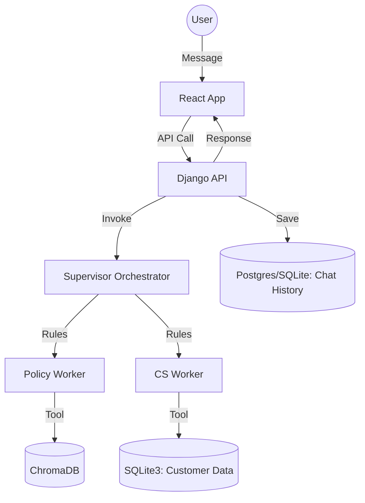

# TCS Support Orchestration System

This project implements a full-stack automated customer support orchestration system using **LangGraph**, **Django**, and **React**. It leverages a multi-agent "Orchestration-Worker" model to handle support tickets by combining bank policy document retrieval with live customer transaction history.

## 🏗️ Architecture

The system consists of a modular backend and a modern frontend, orchestrated via Docker.

### 1. The Orchestrator (Backend)
- **Framework**: Django REST Framework + LangGraph.
- **Supervisor**: A rule-based orchestrator that ensures support tickets are validated against **Bank Policy** before analyzing **Customer Information**.
- **Specialized Workers**:
    - **Policy Expert**: RAG-based search through `Customer-Service-Policy.pdf` using ChromaDB.
    - **CS Representative**: SQL-based analysis of customer profile and ticket history.
- **Persistence**: Django models (`Conversation`, `Message`) store every interaction, accessible via the Django Admin panel.

### 2. The Interface (Frontend)
- **Framework**: React + Vite + Tailwind CSS.
- **Features**: Real-time chat interface, message history, and responsive design.

### 3. Data Flow


---

## 🚀 Getting Started

### Prerequisites
- Docker & Docker Compose

### Quick Start
1. **Clone the repository**:
   ```bash
   git clone https://github.com/s29zafar/TCS_test.git
   cd TCS_test
   ```

2. **Run with Docker**:
   ```bash
   docker-compose up --build
   ```
   - **Frontend**: [http://localhost:5173](http://localhost:5173)
   - **Backend API**: [http://localhost:8000/api/](http://localhost:8000/api/)
   - **Admin Panel**: [http://localhost:8000/admin/](http://localhost:8000/admin/)

---

## 🛠️ Tech Stack
- **AI/LLM**: LangGraph, LangChain, HuggingFace (GPT-2 for demo)
- **Backend**: Django, Django REST Framework
- **Frontend**: React, Tailwind CSS, Lucide React
- **Vector Search**: ChromaDB
- **Embeddings**: HuggingFace `all-MiniLM-L6-v2`
- **Database**: SQLite3 (Customer Data & Chat History)
- **Deployment**: Docker, Docker Compose

---

## 🧪 Testing
Run backend tests to verify API and model persistence:
```bash
docker-compose exec backend python manage.py test chatbot
```
