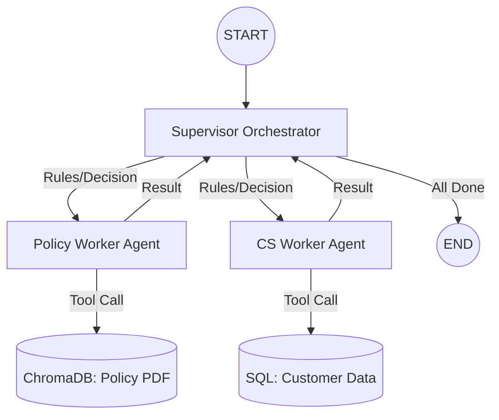

# TCS Support Orchestration System

This project implements an automated customer support orchestration system using **LangGraph** and **LangChain**. It leverages a multi-agent "Orchestration-Worker" model to handle support tickets by combining bank policy document retrieval with live customer transaction history.

## 🏗️ Architecture: Orchestration-Worker Model

The system follows a modular architecture where a central **Supervisor** orchestrates specialized **Worker Agents**.

### 1. The Orchestrator (Supervisor)
The `supervisor_node` acts as the brain of the operation. In this implementation, it follows a robust rule-based logic to ensure a high-quality response:
- **Decision Logic**: It ensures that a support ticket is first validated against the **Bank Policy** before moving to **Customer Information** analysis.
- **State Management**: It maintains a shared `State` object that tracks messages, current stage, and completed stages, ensuring no duplicate work and a coherent final response.

### 2. The Workers (Specialized Agents)
Each agent is a specialized "Worker" node inside the LangGraph. They are implemented as ReAct agents that can think, act (call tools), and observe.

- **Policy Expert (`Policy Check`)**:
  - **Tool**: `search_bank_policy` (RAG-based search through `Customer-Service-Policy.pdf`).
  - **Goal**: Identify violations or compliance with internal banking regulations.
- **CS Representative (`Customer Information Check`)**:
  - **Tools**: `get_user_info`, `get_user_ticker`.
  - **Goal**: Analyze the customer's profile and past support history to provide context.

### 3. Data Flow Diagram


---

## 🚀 Project Setup

### Prerequisites
- Python 3.12 (Recommended)
- Virtual Environment support

### Installation
1. **Clone the repository**:
   ```bash
   git clone https://github.com/s29zafar/TCS_test.git
   cd TCS_test
   ```

2. **Setup Dependencies**:
   Run the following block inside your development environment to ensure all core libraries and classic compatibility layers are installed:
   ```bash
   pip install langgraph langchain langchain-core langchain-community langchain-chroma langchain-huggingface transformers accelerate torch chromadb faker kagglehub pandas numpy pydantic typing-extensions pysqlite3 langchain-classic
   ```

### Data Preparation
The system automatically handles:
- **SQLite Initialization**: Creates `TestTCS.db` and populates it with synthetic customer data.
- **Vector DB Construction**: Ingests `Customer-Service-Policy.pdf` into a local ChromaDB instance at `./chroma_db`.

---

## 📖 Usage Instructions

1. **Open the Notebook**: Launch `TCS_test.ipynb` in your preferred Jupyter environment.
2. **Environment Configuration**: 
   - Ensure you have the `Customer-Service-Policy.pdf` in the root directory.
   - Run the initial environment check cells to confirm all modules load correctly.
3. **Execution**:
   - Run the **"Consolidated Imports"** cell.
   - Run the **"Setup the Model"** cell (downloads Qwen-0.6B).
   - Execute the **"Orchestrator"** cell to build the graph.
   - Run the final **"Graph Execution"** cell to process a test ticket.

---

## 🛠️ Tech Stack
- **Framework**: LangGraph, LangChain
- **Model**: Qwen 0.6B (HuggingFace)
- **Vector Search**: ChromaDB
- **Embeddings**: HuggingFace `all-MiniLM-L6-v2`
- **Database**: SQLite3
- **Data Generation**: Faker, KaggleHub
